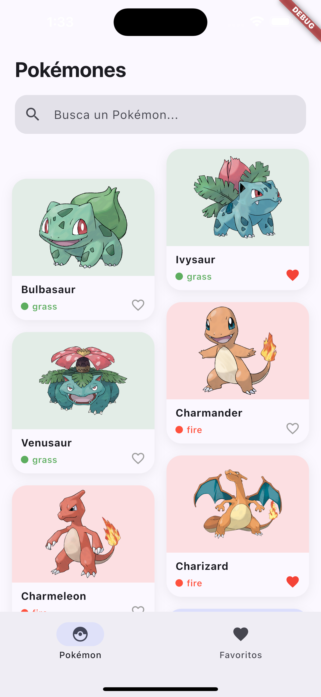
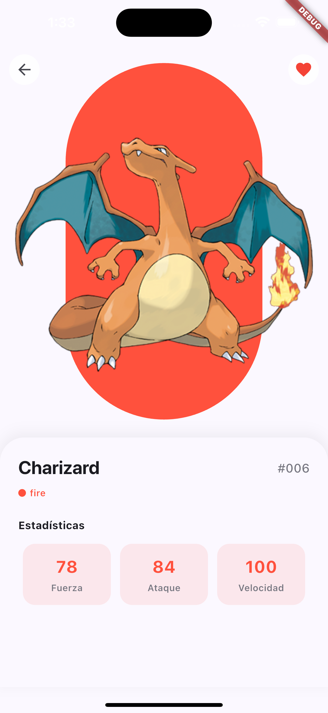
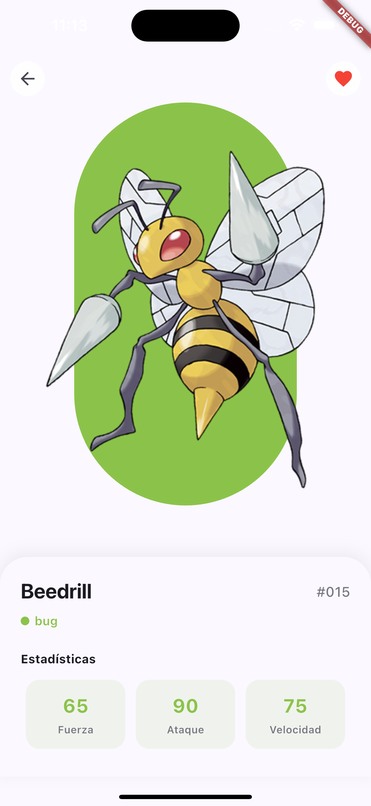
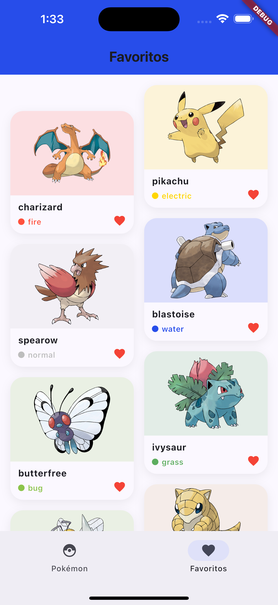

# Pokédex Flutter

Aplicación móvil desarrollada en Flutter que consume la [PokéAPI](https://pokeapi.co/) para explorar pokémons, ver sus estadísticas y guardar favoritos.

Desarrollada como proyecto del Bootcamp **Flutter Essentials** impartido por el Profesor Pablo Chaves de [Knot Academy](https://knotacademy.com.co/).

## Screenshots

<table>
  <tr>
    <td align="center"><b>Grid Pokémons</b></td>
    <td align="center"><b>Detalle</b></td>
    <td align="center"><b>Detalle</b></td>
    <td align="center"><b>Favoritos</b></td>
  </tr>
  <tr>
    <td></td>
    <td></td>
    <td></td>
    <td></td>
  </tr>
</table>

## Features

- Grid de pokémons con colores por tipo
- Scroll infinito con carga de páginas
- Búsqueda por nombre con debounce
- Detalle con imagen, tipo y estadísticas
- Favoritos persistentes sin conexión
- Manejo de errores con reintentar

## Tech Stack

| Paquete | Uso |
|---|---|
| [Dio](https://pub.dev/packages/dio) | Cliente HTTP |
| [go_router](https://pub.dev/packages/go_router) | Navegación |
| [shared_preferences](https://pub.dev/packages/shared_preferences) | Persistencia local |

## Arquitectura

```
lib/
├── models/
│   ├── pokemon.dart          # Modelo liviano para el grid
│   ├── pokemon_detail.dart   # Modelo completo para el detalle
│   └── pokemon_stat.dart     # Estadística individual
├── services/
│   ├── pokemon_service.dart  # Llamadas a la PokéAPI
│   └── favorites_service.dart# Persistencia de favoritos
├── screens/
│   ├── home_screen.dart      # Grid principal
│   ├── detail_screen.dart    # Detalle del pokémon
│   └── favorites_screen.dart # Pokémons guardados
├── widgets/
│   ├── pokemon_card.dart     # Card del grid
│   ├── type_chip.dart        # Indicador de tipo con color
│   ├── error_view.dart       # Vista de error reutilizable
│   └── app_scaffold.dart     # Scaffold con NavigationBar
├── router/
│   └── app_router.dart       # Rutas con go_router
└── theme/
    └── app_theme.dart        # Paleta de colores
```

## Instalación

```bash
# Clonar el repositorio
git clone https://github.com/wilderpalacios/flutter-pokemon.git

# Instalar dependencias
flutter pub get

# Correr la app
flutter run
```

## Requisitos

- Flutter 3.x
- Dart 3.x
- Conexión a internet para cargar pokémons
